<div align="center">


# Celeris

**Distributed data, at speed. Consistency you choose per request.**

A self-hostable, replicated JSON key-value database written in Rust.
One binary. Raft-replicated. Five consistency modes, picked on every read and write.

[](LICENSE)


</div>

> Celeris does not break the CAP theorem. During a network partition no
> system can be both linearizable and unconditionally available. Celeris
> makes that trade-off an explicit, per-operation choice instead of a
> database-wide setting: `strict`, `session`, `bounded`, `available`,
> `eventual`. See [docs/CONSISTENCY.md](docs/CONSISTENCY.md).

**Contents**
[Why Celeris](#why-celeris) ·
[Quick start](#quick-start) ·
[Architecture](#architecture) ·
[Runtime topology](#runtime-topology) ·
[Request lifecycle](#how-a-request-flows) ·
[Consistency](#consistency-modes-in-depth) ·
[Storage engine](#storage-engine-low-level-design) ·
[Partitioning](#partitioning-and-placement) ·
[Raft and membership](#replication-raft-and-membership) ·
[Rebalancing](#elasticity-live-partition-migration) ·
[Queries](#queries-and-change-streams) ·
[Security](#security-model) ·
[Deployment](#deployment-topologies) ·
[Testing](#how-it-is-verified) ·
[Performance](#performance) ·
[Limits](#known-limits)

---

## Why Celeris

Most databases make you pick one consistency level for the whole system, and
then hide what happens when the network breaks. Celeris lets every request say
what it needs, and tells you what it actually got.

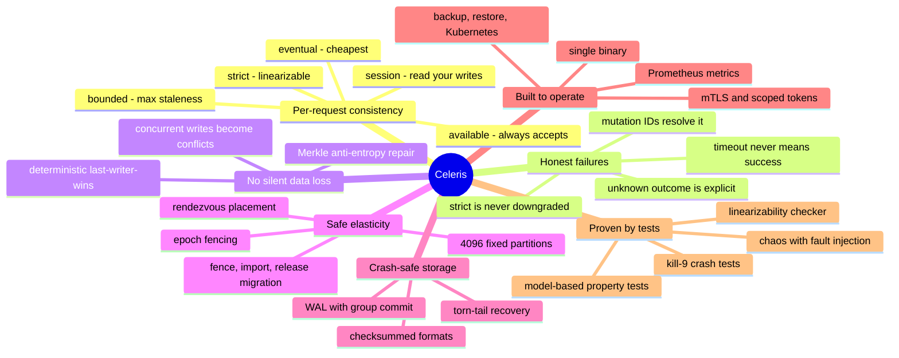
```mermaid
mindmap
  root((Celeris))
    Per-request consistency
      strict - linearizable
      session - read your writes
      bounded - max staleness
      available - always accepts
      eventual - cheapest
    Honest failures
      timeout never means success
      unknown outcome is explicit
      mutation IDs resolve it
      strict is never downgraded
    No silent data loss
      concurrent writes become conflicts
      deterministic last-writer-wins
      Merkle anti-entropy repair
    Safe elasticity
      4096 fixed partitions
      rendezvous placement
      epoch fencing
      fence, import, release migration
    Crash-safe storage
      WAL with group commit
      checksummed formats
      torn-tail recovery
    Built to operate
      single binary
      Prometheus metrics
      mTLS and scoped tokens
      backup, restore, Kubernetes
    Proven by tests
      linearizability checker
      chaos with fault injection
      kill-9 crash tests
      model-based property tests
```

| | What you get | Why it matters |
|---|---|---|
| **Consistency per operation** | Five modes on every call: `?consistency=strict` or a header | Payments can be linearizable while a feed stays fast and always writable, in the same database |
| **Truthful responses** | Every response reports the mode that was applied, plus version, epoch and staleness | You never wonder whether a read was fresh |
| **Writes you can retry** | Every write carries a mutation ID; retries are deduplicated; `GET /v1/mutations/{id}` answers "did it commit?" | A network timeout never turns into a duplicate charge or a lost order |
| **Conflicts are data, not accidents** | `available` writes during a partition are ordered by a deterministic rule and every loser is kept at `/v1/conflicts` | Availability without silent overwrites |
| **Replicas that agree exactly** | One Raft log per replica set, leader-stamped timestamps, same versions on every replica | Compare-and-set (`if_version`) keeps working across failover |
| **Elastic without downtime** | Add or lose a node; partitions migrate with fence, import, release | Ownership never overlaps, so a strict read is never served stale |
| **Rich queries without a query language** | JSON filters, secondary indexes, sort, aggregates, pushed down to the replica sets | Only matching rows cross the network |
| **Live data** | WebSocket change streams by key prefix | Real-time UIs without a separate message bus |
| **Easy to run** | One binary, a Docker image, a Kubernetes StatefulSet, Prometheus metrics | No JVM, no ZooKeeper, no sidecars |
| **Verified, not asserted** | Linearizability checker under leader failure, seeded chaos suite, kill-9 crash tests | The claims in this README have tests behind them |

**A good fit:** session and user state, carts, feature flags, counters and
inventory, device state, collaboration data, anything keyed that needs a dial
between "always correct" and "always up".
**Not a fit (yet):** SQL, multi-key ACID transactions across partitions,
analytics scans over huge ranges. Celeris is pre-1.0; read
[Known limits](#known-limits) before betting production data on it.

---

## Status

Pre-1.0. Single nodes and replicated clusters both work, with SDKs for
TypeScript (plus a React hook), Python, Rust and Go. See
[docs/ROADMAP.md](docs/ROADMAP.md) for what is left.

| Milestone | State |
|---|---|
| 0. Workspace, CI, lint, test | done |
| 1. Storage engine: WAL, memtable, SSTables, bloom, block cache, compaction, TTL, crash recovery | done |
| 2. HTTP API + CLI + metrics | done |
| 3. Partitioning: 4096 partitions, zone-aware rendezvous placement, epochs | done |
| 4. Membership, Raft control plane, per-replica-set Raft groups, snapshots, migration, rebalancing | done |
| 5. STRICT mode, checked by a linearizability checker under leader failure | done |
| 6. AVAILABLE / EVENTUAL modes: local accept, reconciliation, conflicts, anti-entropy | done |
| 7. SDKs (TypeScript + React, Python, Rust, Go) and WebSocket change streams | done |
| 8. Docker, compose, Kubernetes, AWS guide, admin console, website, release binaries | done ([docs/DEPLOYMENT.md](docs/DEPLOYMENT.md)) |
| 9. Hardening: auth, TLS and cluster mTLS, backup/restore, benchmarks, chaos suite | done |
| 10. Queries: JSON filters, secondary indexes, sorting and aggregates, pushed down to replica sets | done |

## Quick start

```bash
cargo build --release
./target/release/celeris init                 # writes ./celeris.toml
./target/release/celeris start                # node on 127.0.0.1:8080
```

In another terminal:

```bash
celeris put users/42 '{"name":"Vinit"}'
celeris get users/42
celeris put sessions/abc '"token"' --ttl 30m
celeris put users/42 '{"name":"V"}' --if-version 1   # compare-and-set
celeris scan --prefix users/
celeris query --prefix users/ --where '{"name":{"$prefix":"V"}}'
celeris status
celeris doctor
celeris stop
```

Or with plain HTTP:

```bash
curl -X PUT localhost:8080/v1/kv/users/42 -d '{"name":"Vinit"}'
curl localhost:8080/v1/kv/users/42?consistency=strict
curl localhost:8080/metrics
```

API reference: [docs/API.md](docs/API.md). CLI reference: [docs/CLI.md](docs/CLI.md).

### A 3-node cluster with Docker

```bash
docker compose up -d --build        # nodes on localhost:8081, 8082, 8083
curl -X PUT localhost:8081/v1/kv/hello -d '"world"'
curl "localhost:8083/v1/kv/hello?consistency=eventual"
```

Once every voter is up, the control-plane leader places partitions with
three replicas on its own (`cluster.replication_factor`). Writes go through
the Raft group of the key's replica set; a replica that does not lead the
group answers `421 not_leader`, which the SDKs follow automatically.

### SDKs

| Language | Path | Highlights |
|---|---|---|
| TypeScript | [sdks/typescript](sdks/typescript) | browsers and Node.js, `useCeleris()` React hook |
| Python | [sdks/python](sdks/python) | standard library only |
| Rust | [sdks/rust](sdks/rust) | async (`tokio`), typed values via serde |
| Go | [sdks/go](sdks/go) | standard library only |

An admin console ([console/](console)) shows nodes, Raft, partitions, data,
live changes and conflicts in the browser: `cd console && npm install && npm run dev`.

Every SDK retries writes with the same mutation ID, follows redirects,
tracks session tokens, and reports an *unknown outcome* instead of a
failure when a write may have committed.

---

## Architecture

### The whole system on one page

Clients talk HTTP/JSON (or WebSocket) to any node. Each node is one process
with three layers: an **API layer** that authenticates and routes, a
**cluster layer** that agrees on who owns what and replicates writes, and a
**storage layer** that persists them.

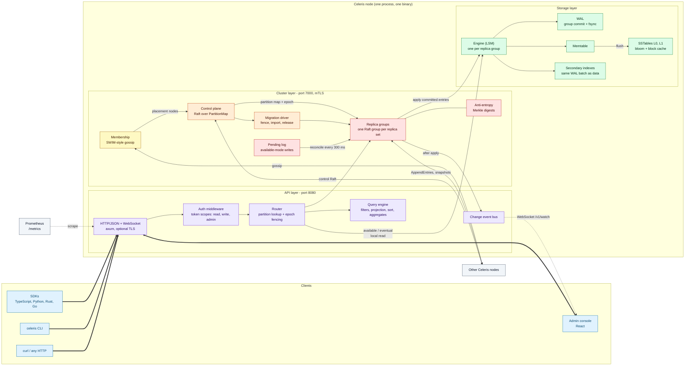
```mermaid
flowchart LR
  classDef client fill:#e0f2fe,stroke:#0369a1,color:#0c4a6e
  classDef api fill:#ede9fe,stroke:#6d28d9,color:#2e1065
  classDef ctl fill:#ffedd5,stroke:#c2410c,color:#431407
  classDef raft fill:#fee2e2,stroke:#b91c1c,color:#450a0a
  classDef gossip fill:#fef9c3,stroke:#a16207,color:#422006
  classDef store fill:#dcfce7,stroke:#15803d,color:#052e16
  classDef ext fill:#f1f5f9,stroke:#475569,color:#0f172a

  subgraph CLIENTS["Clients"]
    direction TB
    SDK["SDKs<br/>TypeScript, Python, Rust, Go"]:::client
    CLI["celeris CLI"]:::client
    CON["Admin console<br/>React"]:::client
    CURL["curl / any HTTP"]:::client
  end

  subgraph NODE["Celeris node (one process, one binary)"]
    direction TB

    subgraph APIL["API layer - port 8080"]
      direction TB
      HTTP["HTTP/JSON + WebSocket<br/>axum, optional TLS"]:::api
      AUTH["Auth middleware<br/>token scopes: read, write, admin"]:::api
      ROUTE["Router<br/>partition lookup + epoch fencing"]:::api
      QRY["Query engine<br/>filters, projection, sort, aggregates"]:::api
      BUS["Change event bus"]:::api
      HTTP --> AUTH --> ROUTE
      ROUTE --> QRY
    end

    subgraph CLUL["Cluster layer - port 7000, mTLS"]
      direction TB
      MEM["Membership<br/>SWIM-style gossip"]:::gossip
      CTRL["Control plane<br/>Raft over PartitionMap"]:::ctl
      GRP["Replica groups<br/>one Raft group per replica set"]:::raft
      AE["Anti-entropy<br/>Merkle digests"]:::raft
      PEND["Pending log<br/>available-mode writes"]:::raft
      MIG["Migration driver<br/>fence, import, release"]:::ctl
      MEM -->|"placement nodes"| CTRL
      CTRL -->|"partition map + epoch"| GRP
      CTRL --> MIG
      MIG --> GRP
      GRP --- AE
      PEND -->|"reconcile every 300 ms"| GRP
    end

    subgraph STL["Storage layer"]
      direction TB
      ENG["Engine (LSM)<br/>one per replica group"]:::store
      WAL["WAL<br/>group commit + fsync"]:::store
      MT["Memtable"]:::store
      SST["SSTables L0, L1<br/>bloom + block cache"]:::store
      IDX["Secondary indexes<br/>same WAL batch as data"]:::store
      ENG --> WAL
      ENG --> MT
      MT -->|"flush"| SST
      ENG --> IDX
    end

    ROUTE --> GRP
    ROUTE -->|"available / eventual<br/>local read"| ENG
    GRP -->|"apply committed entries"| ENG
    GRP -->|"after apply"| BUS
  end

  PEERS["Other Celeris nodes"]:::ext
  PROM["Prometheus<br/>/metrics"]:::ext

  SDK & CLI & CON & CURL ==> HTTP
  BUS -.->|"WebSocket /v1/watch"| CON
  MEM <-->|"gossip"| PEERS
  GRP <-->|"AppendEntries, snapshots"| PEERS
  CTRL <-->|"control Raft"| PEERS
  PROM -.->|"scrape"| HTTP
```

### Crates and how they depend on each other

The workspace is split so that the parts which decide things (consensus,
placement, membership) have no I/O and can be tested by simulation.

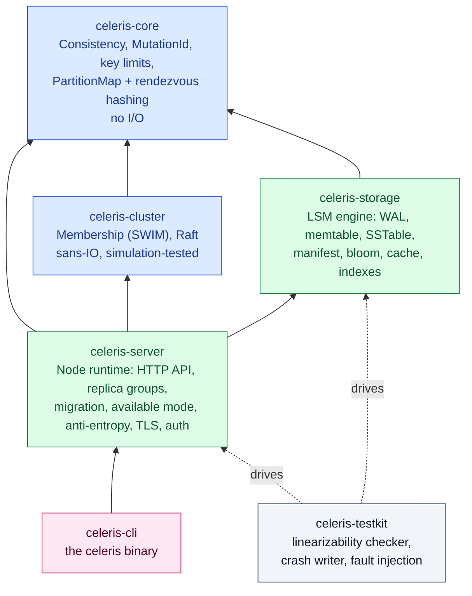
```mermaid
flowchart BT
  classDef pure fill:#dbeafe,stroke:#1d4ed8,color:#1e3a8a
  classDef io fill:#dcfce7,stroke:#15803d,color:#14532d
  classDef bin fill:#fce7f3,stroke:#be185d,color:#500724
  classDef test fill:#f1f5f9,stroke:#475569,color:#0f172a

  CORE["celeris-core<br/>Consistency, MutationId, key limits,<br/>PartitionMap + rendezvous hashing<br/>no I/O"]:::pure
  CLUSTER["celeris-cluster<br/>Membership (SWIM), Raft<br/>sans-IO, simulation-tested"]:::pure
  STORAGE["celeris-storage<br/>LSM engine: WAL, memtable, SSTable,<br/>manifest, bloom, cache, indexes"]:::io
  SERVER["celeris-server<br/>Node runtime: HTTP API, replica groups,<br/>migration, available mode, anti-entropy, TLS, auth"]:::io
  CLI["celeris-cli<br/>the celeris binary"]:::bin
  TESTKIT["celeris-testkit<br/>linearizability checker,<br/>crash writer, fault injection"]:::test

  CLUSTER --> CORE
  STORAGE --> CORE
  SERVER --> CORE
  SERVER --> CLUSTER
  SERVER --> STORAGE
  CLI --> SERVER
  TESTKIT -.->|"drives"| SERVER
  TESTKIT -.->|"drives"| STORAGE
```

### Low-level design: the main types

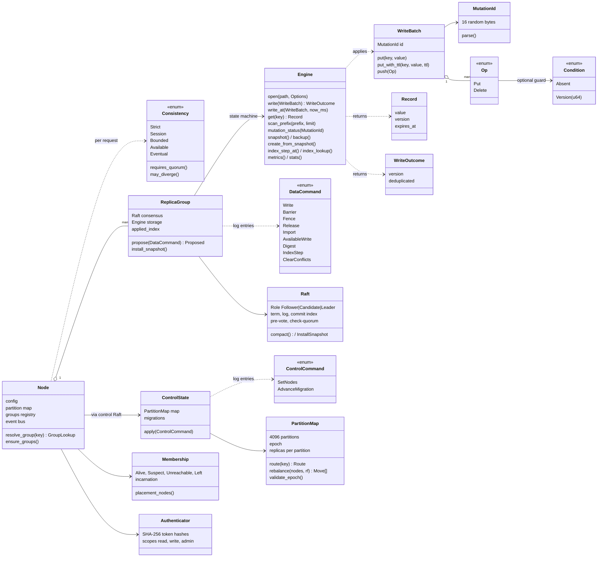
```mermaid
classDiagram
  direction LR

  class Consistency {
    <<enum>>
    Strict
    Session
    Bounded
    Available
    Eventual
    requires_quorum()
    may_diverge()
  }
  class MutationId {
    16 random bytes
    parse()
  }
  class WriteBatch {
    MutationId id
    put(key, value)
    put_with_ttl(key, value, ttl)
    push(Op)
  }
  class Op {
    <<enum>>
    Put
    Delete
  }
  class Condition {
    <<enum>>
    Absent
    Version(u64)
  }
  class Engine {
    open(path, Options)
    write(WriteBatch) WriteOutcome
    write_at(WriteBatch, now_ms)
    get(key) Record
    scan_prefix(prefix, limit)
    mutation_status(MutationId)
    snapshot() / backup()
    create_from_snapshot()
    index_step_at() / index_lookup()
    metrics() / stats()
  }
  class Record {
    value
    version
    expires_at
  }
  class WriteOutcome {
    version
    deduplicated
  }
  class Node {
    config
    partition map
    groups registry
    event bus
    resolve_group(key) GroupLookup
    ensure_groups()
  }
  class ReplicaGroup {
    Raft consensus
    Engine storage
    propose(DataCommand) Proposed
    applied_index
    install_snapshot()
  }
  class DataCommand {
    <<enum>>
    Write
    Barrier
    Fence
    Release
    Import
    AvailableWrite
    Digest
    IndexStep
    ClearConflicts
  }
  class Raft {
    Role Follower|Candidate|Leader
    term, log, commit index
    pre-vote, check-quorum
    compact() / InstallSnapshot
  }
  class ControlState {
    PartitionMap map
    migrations
    apply(ControlCommand)
  }
  class ControlCommand {
    <<enum>>
    SetNodes
    AdvanceMigration
  }
  class PartitionMap {
    4096 partitions
    epoch
    replicas per partition
    route(key) Route
    rebalance(nodes, rf) Move[]
    validate_epoch()
  }
  class Membership {
    Alive, Suspect, Unreachable, Left
    incarnation
    placement_nodes()
  }
  class Authenticator {
    SHA-256 token hashes
    scopes read, write, admin
  }

  WriteBatch "1" o-- "many" Op
  Op --> Condition : optional guard
  WriteBatch --> MutationId
  Engine ..> WriteBatch : applies
  Engine ..> Record : returns
  Engine ..> WriteOutcome : returns
  Node "1" o-- "many" ReplicaGroup
  Node --> Membership
  Node --> ControlState : via control Raft
  Node --> Authenticator
  ReplicaGroup --> Raft
  ReplicaGroup --> Engine : state machine
  ReplicaGroup ..> DataCommand : log entries
  ControlState --> PartitionMap
  ControlState ..> ControlCommand : log entries
  Node ..> Consistency : per request
```

---

## Runtime topology

### A 3-node cluster (the default)

Every node is a **control-plane voter** and a **data replica**. With three
nodes and replication factor 3, the whole keyspace lives in one replica
group, so every node holds every key and a write needs 2 of 3 acknowledgements.

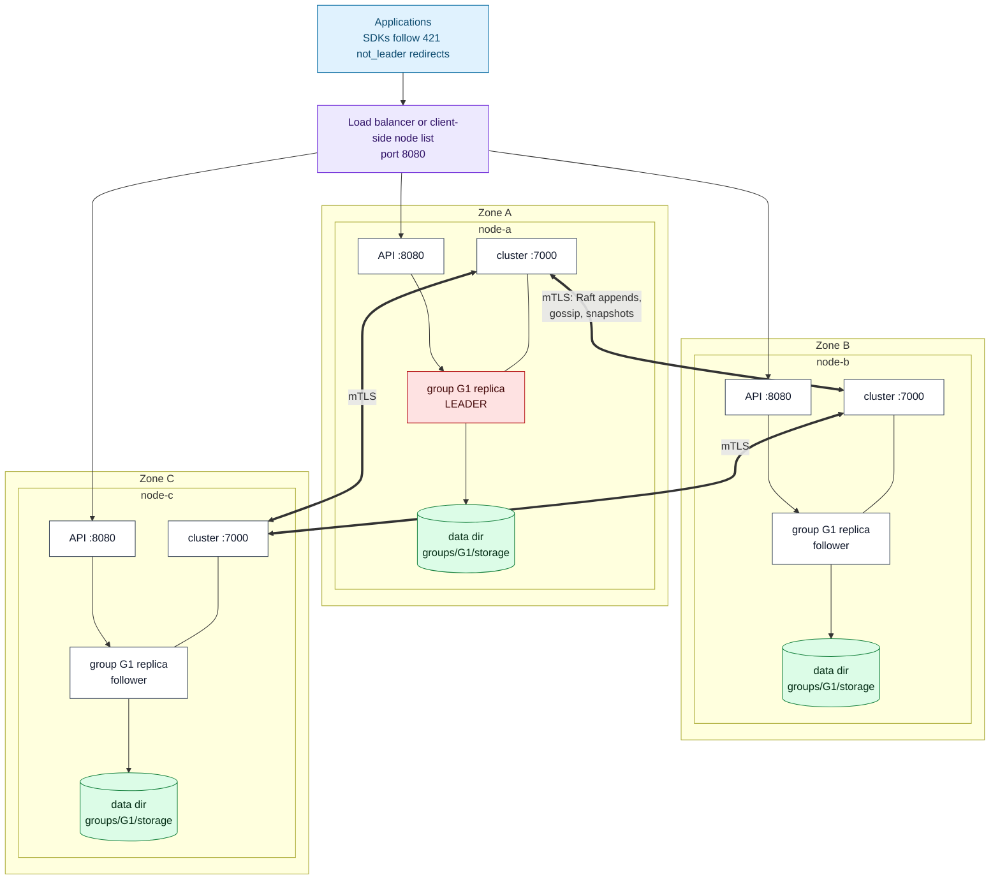
```mermaid
flowchart TB
  classDef client fill:#e0f2fe,stroke:#0369a1,color:#0c4a6e
  classDef node fill:#ffffff,stroke:#334155,color:#0f172a
  classDef lead fill:#fee2e2,stroke:#b91c1c,color:#450a0a
  classDef disk fill:#dcfce7,stroke:#15803d,color:#052e16
  classDef lb fill:#ede9fe,stroke:#6d28d9,color:#2e1065

  APP["Applications<br/>SDKs follow 421 not_leader redirects"]:::client
  LB["Load balancer or client-side node list<br/>port 8080"]:::lb
  APP --> LB

  subgraph ZA["Zone A"]
    subgraph NA["node-a"]
      A_API["API :8080"]:::node
      A_CL["cluster :7000"]:::node
      A_G["group G1 replica<br/>LEADER"]:::lead
      A_DISK[("data dir<br/>groups/G1/storage")]:::disk
      A_API --> A_G --> A_DISK
      A_CL --- A_G
    end
  end
  subgraph ZB["Zone B"]
    subgraph NB["node-b"]
      B_API["API :8080"]:::node
      B_CL["cluster :7000"]:::node
      B_G["group G1 replica<br/>follower"]:::node
      B_DISK[("data dir<br/>groups/G1/storage")]:::disk
      B_API --> B_G --> B_DISK
      B_CL --- B_G
    end
  end
  subgraph ZC["Zone C"]
    subgraph NC["node-c"]
      C_API["API :8080"]:::node
      C_CL["cluster :7000"]:::node
      C_G["group G1 replica<br/>follower"]:::node
      C_DISK[("data dir<br/>groups/G1/storage")]:::disk
      C_API --> C_G --> C_DISK
      C_CL --- C_G
    end
  end

  LB --> A_API & B_API & C_API
  A_CL <==>|"mTLS: Raft appends,<br/>gossip, snapshots"| B_CL
  A_CL <==>|"mTLS"| C_CL
  B_CL <==>|"mTLS"| C_CL
```

### Two Raft layers, one gossip layer

Celeris separates **who owns what** (rare, must be consensus-backed) from
**what the data is** (frequent, replicated per replica set). Gossip only
tells the control plane who looks alive; it never decides ownership.

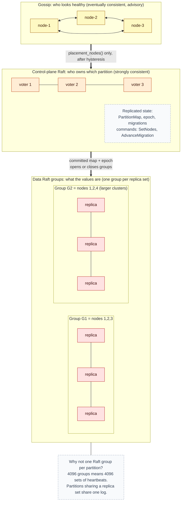
```mermaid
flowchart TB
  classDef ctl fill:#ffedd5,stroke:#c2410c,color:#431407
  classDef raft fill:#fee2e2,stroke:#b91c1c,color:#450a0a
  classDef gossip fill:#fef9c3,stroke:#a16207,color:#422006
  classDef note fill:#f8fafc,stroke:#94a3b8,color:#334155,stroke-dasharray: 4 3

  subgraph G["Gossip: who looks healthy (eventually consistent, advisory)"]
    direction LR
    g1["node-1"]:::gossip <--> g2["node-2"]:::gossip
    g2 <--> g3["node-3"]:::gossip
    g1 <--> g3
  end

  subgraph C["Control-plane Raft: who owns which partition (strongly consistent)"]
    direction LR
    c1["voter 1"]:::ctl --- c2["voter 2"]:::ctl --- c3["voter 3"]:::ctl
    CS["Replicated state:<br/>PartitionMap, epoch, migrations<br/>commands: SetNodes, AdvanceMigration"]:::note
  end

  subgraph D["Data Raft groups: what the values are (one group per replica set)"]
    direction LR
    subgraph D1["Group G1 = nodes 1,2,3"]
      d11["replica"]:::raft --- d12["replica"]:::raft --- d13["replica"]:::raft
    end
    subgraph D2["Group G2 = nodes 1,2,4 (larger clusters)"]
      d21["replica"]:::raft --- d22["replica"]:::raft --- d24["replica"]:::raft
    end
  end

  G ==>|"placement_nodes() only, after hysteresis"| C
  C ==>|"committed map + epoch<br/>opens or closes groups"| D
  NOTE["Why not one Raft group per partition?<br/>4096 groups means 4096 sets of heartbeats.<br/>Partitions sharing a replica set share one log."]:::note
  D --- NOTE
```

*Illustrative note on larger clusters:* in the current release, data nodes
must also be control-plane voters (3 or 5), so the number of distinct
replica sets stays small.

### Ports and traffic

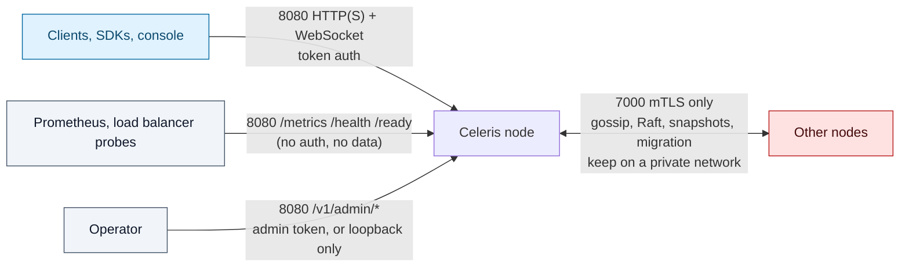
```mermaid
flowchart LR
  classDef pub fill:#e0f2fe,stroke:#0369a1,color:#0c4a6e
  classDef priv fill:#fee2e2,stroke:#b91c1c,color:#450a0a
  classDef ops fill:#f1f5f9,stroke:#475569,color:#0f172a

  U["Clients, SDKs, console"]:::pub -->|"8080 HTTP(S) + WebSocket<br/>token auth"| N["Celeris node"]
  P["Prometheus, load balancer probes"]:::ops -->|"8080 /metrics /health /ready<br/>(no auth, no data)"| N
  A["Operator"]:::ops -->|"8080 /v1/admin/*<br/>admin token, or loopback only"| N
  N <-->|"7000 mTLS only<br/>gossip, Raft, snapshots, migration<br/>keep on a private network"| O["Other nodes"]:::priv
```

---

## How a request flows

### A strict write in a replicated cluster

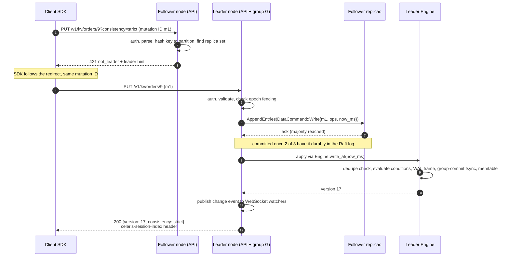
```mermaid
sequenceDiagram
  autonumber
  participant C as Client SDK
  participant F as Follower node (API)
  participant L as Leader node (API + group G)
  participant R as Follower replicas
  participant E as Leader Engine

  C->>F: PUT /v1/kv/orders/9?consistency=strict (mutation ID m1)
  F->>F: auth, parse, hash key to partition, find replica set
  F-->>C: 421 not_leader + leader hint
  Note over C: SDK follows the redirect, same mutation ID
  C->>L: PUT /v1/kv/orders/9 (m1)
  L->>L: auth, validate, check epoch fencing
  L->>R: AppendEntries(DataCommand::Write{m1, ops, now_ms})
  R-->>L: ack (majority reached)
  Note over L,R: committed once 2 of 3 have it durably in the Raft log
  L->>E: apply via Engine.write_at(now_ms)
  E->>E: dedupe check, evaluate conditions, WAL frame, group-commit fsync, memtable
  E-->>L: version 17
  L->>L: publish change event to WebSocket watchers
  L-->>C: 200 {version: 17, consistency: strict}<br/>celeris-session-index header
```

If no confirmation arrives within 5 seconds, the API answers
`outcome_unknown`. The client resolves it with `GET /v1/mutations/m1`. A
proposal whose log slot was taken by another leader's entry answers
`proposal_lost`, which is safe to retry.

### Retry safety: why a timeout never means success

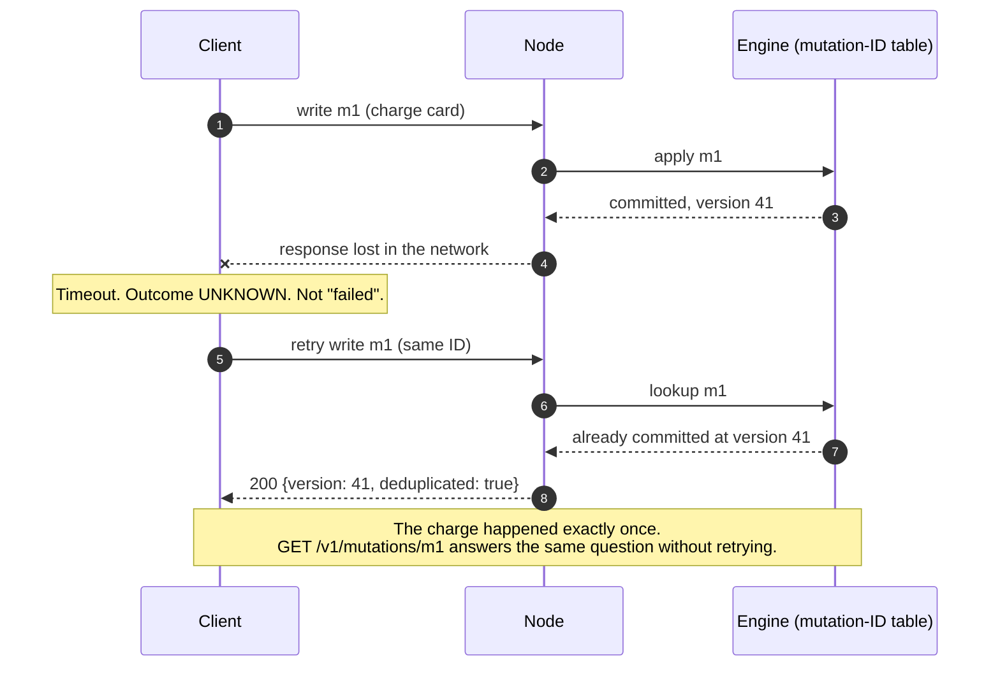
```mermaid
sequenceDiagram
  autonumber
  participant C as Client
  participant N as Node
  participant E as Engine (mutation-ID table)

  C->>N: write m1 (charge card)
  N->>E: apply m1
  E-->>N: committed, version 41
  N--xC: response lost in the network
  Note over C: Timeout. Outcome UNKNOWN. Not "failed".
  C->>N: retry write m1 (same ID)
  N->>E: lookup m1
  E-->>N: already committed at version 41
  N-->>C: 200 {version: 41, deduplicated: true}
  Note over C,E: The charge happened exactly once.<br/>GET /v1/mutations/m1 answers the same question without retrying.
```

### Which replica serves a read?

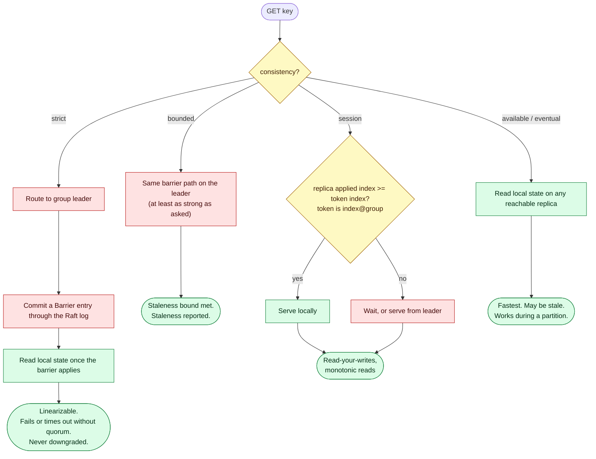
```mermaid
flowchart TD
  classDef q fill:#fef9c3,stroke:#a16207,color:#422006
  classDef a fill:#dcfce7,stroke:#15803d,color:#052e16
  classDef w fill:#fee2e2,stroke:#b91c1c,color:#450a0a

  R(["GET key"]) --> M{"consistency?"}:::q
  M -->|strict| S1["Route to group leader"]:::w
  S1 --> S2["Commit a Barrier entry through the Raft log"]:::w
  S2 --> S3["Read local state once the barrier applies"]:::a
  S3 --> SR(["Linearizable.<br/>Fails or times out without quorum.<br/>Never downgraded."]):::a

  M -->|bounded| B1["Same barrier path on the leader<br/>(at least as strong as asked)"]:::w
  B1 --> BR(["Staleness bound met.<br/>Staleness reported."]):::a

  M -->|session| T1{"replica applied index >= token index?<br/>token is index@group"}:::q
  T1 -->|yes| T2["Serve locally"]:::a
  T1 -->|no| T3["Wait, or serve from leader"]:::w
  T2 --> TR(["Read-your-writes,<br/>monotonic reads"]):::a
  T3 --> TR

  M -->|"available / eventual"| E1["Read local state on any reachable replica"]:::a
  E1 --> ER(["Fastest. May be stale.<br/>Works during a partition."]):::a
```

---

## Consistency modes in depth

| Mode | During a partition | Guarantee | Coordination cost |
|---|---|---|---|
| `strict` | may reject or wait for quorum | linearizable per key | quorum round-trip |
| `session` | may route to a replica that has the session's writes, or wait | read-your-writes, monotonic reads | session token check |
| `bounded` | fails if no replica is fresh enough | staleness no greater than the caller's bound | freshness metadata |
| `available` | accepts on any reachable replica | eventual, conflicts surfaced | none on the write path |
| `eventual` | accepts and reconciles | eventual | none |

Four rules the implementation follows, each with tests:

1. A `strict` operation is **never silently downgraded**. Without quorum it
   fails or times out, with an error that says so.
2. A timeout **never means success**. Unknown outcomes are reported as
   unknown and resolved with the mutation ID.
3. Every response reports the **mode actually applied** (body and
   `celeris-consistency` header), plus the version or epoch.
4. Concurrent `available` writes are **never lost without a documented
   deterministic policy**. They become conflicts, counted as a metric.

### What happens to each mode during a partition

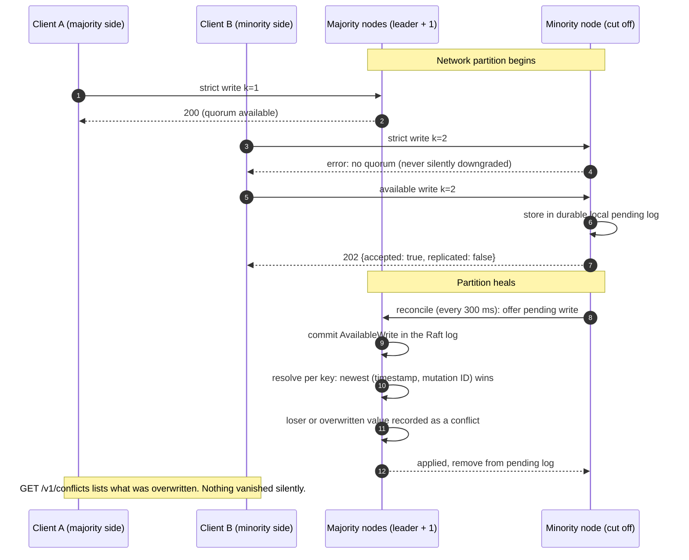
```mermaid
sequenceDiagram
  autonumber
  participant CA as Client A (majority side)
  participant CB as Client B (minority side)
  participant M as Majority nodes (leader + 1)
  participant X as Minority node (cut off)

  Note over M,X: Network partition begins
  CA->>M: strict write k=1
  M-->>CA: 200 (quorum available)
  CB->>X: strict write k=2
  X-->>CB: error: no quorum (never silently downgraded)
  CB->>X: available write k=2
  X->>X: store in durable local pending log
  X-->>CB: 202 {accepted: true, replicated: false}
  Note over M,X: Partition heals
  X->>M: reconcile (every 300 ms): offer pending write
  M->>M: commit AvailableWrite in the Raft log
  M->>M: resolve per key: newest (timestamp, mutation ID) wins
  M->>M: loser or overwritten value recorded as a conflict
  M-->>X: applied, remove from pending log
  Note over CA,CB: GET /v1/conflicts lists what was overwritten. Nothing vanished silently.
```

### Conflict handling for `available` writes

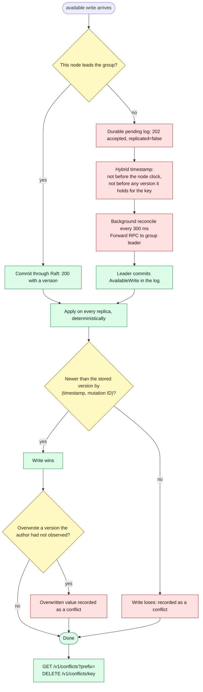
```mermaid
flowchart TD
  classDef a fill:#dcfce7,stroke:#15803d,color:#052e16
  classDef w fill:#fee2e2,stroke:#b91c1c,color:#450a0a
  classDef q fill:#fef9c3,stroke:#a16207,color:#422006

  W(["available write arrives"]) --> L{"This node leads the group?"}:::q
  L -->|yes| RAFT["Commit through Raft: 200 with a version"]:::a
  L -->|no| PEND["Durable pending log: 202 accepted, replicated=false"]:::w
  PEND --> HT["Hybrid timestamp:<br/>not before the node clock,<br/>not before any version it holds for the key"]:::w
  HT --> REC["Background reconcile every 300 ms<br/>Forward RPC to group leader"]:::w
  REC --> LOG["Leader commits AvailableWrite in the log"]:::a
  RAFT --> APPLY
  LOG --> APPLY["Apply on every replica, deterministically"]:::a
  APPLY --> CMP{"Newer than the stored version by<br/>(timestamp, mutation ID)?"}:::q
  CMP -->|yes| WIN["Write wins"]:::a
  CMP -->|no| LOSE["Write loses: recorded as a conflict"]:::w
  WIN --> OBS{"Overwrote a version the author had not observed?"}:::q
  OBS -->|yes| KEEP["Overwritten value recorded as a conflict"]:::w
  OBS -->|no| DONE(["Done"]):::a
  KEEP --> DONE
  LOSE --> DONE
  DONE --> API["GET /v1/conflicts?prefix=<br/>DELETE /v1/conflicts/key"]:::a
```

Anti-entropy backs this up: every `cluster.anti_entropy_interval_ms` (default
60 s) each group leader commits a `Digest` entry; every replica hashes its
data at that exact log position (per-partition xxh3 leaves of a two-level
Merkle tree); a replica that disagrees with a majority containing the
leader is repaired from the leader's snapshot. No acknowledged entry is
dropped, and results are visible under `/v1/status`.

---

## Storage engine: low-level design

Crate `celeris-storage`: single-node, embedded, synchronous. The server runs
it on a blocking pool. Every replica group owns one.

### Write path

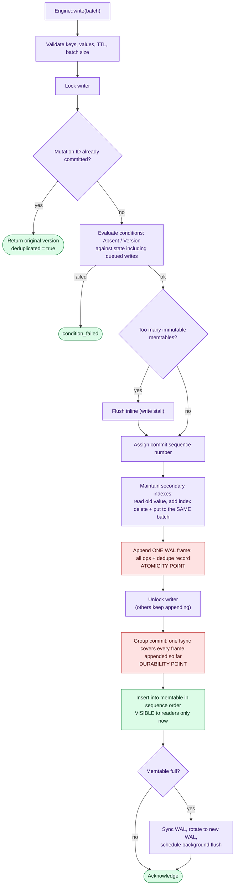
```mermaid
flowchart TD
  classDef step fill:#ede9fe,stroke:#6d28d9,color:#2e1065
  classDef dur fill:#fee2e2,stroke:#b91c1c,color:#450a0a
  classDef vis fill:#dcfce7,stroke:#15803d,color:#052e16

  A["Engine::write(batch)"]:::step --> B["Validate keys, values, TTL, batch size"]:::step
  B --> C["Lock writer"]:::step
  C --> D{"Mutation ID already committed?"}:::step
  D -->|yes| D1(["Return original version<br/>deduplicated = true"]):::vis
  D -->|no| E["Evaluate conditions: Absent / Version<br/>against state including queued writes"]:::step
  E -->|failed| E1(["condition_failed"]):::vis
  E -->|ok| F{"Too many immutable memtables?"}:::step
  F -->|yes| F1["Flush inline (write stall)"]:::step --> G
  F -->|no| G["Assign commit sequence number"]:::step
  G --> H["Maintain secondary indexes:<br/>read old value, add index delete + put to the SAME batch"]:::step
  H --> I["Append ONE WAL frame: all ops + dedupe record<br/>ATOMICITY POINT"]:::dur
  I --> J["Unlock writer<br/>(others keep appending)"]:::step
  J --> K["Group commit: one fsync covers every frame appended so far<br/>DURABILITY POINT"]:::dur
  K --> L["Insert into memtable in sequence order<br/>VISIBLE to readers only now"]:::vis
  L --> M{"Memtable full?"}:::step
  M -->|yes| N["Sync WAL, rotate to new WAL,<br/>schedule background flush"]:::step
  M -->|no| O(["Acknowledge"]):::vis
  N --> O
```

### Group commit: many writers, one fsync

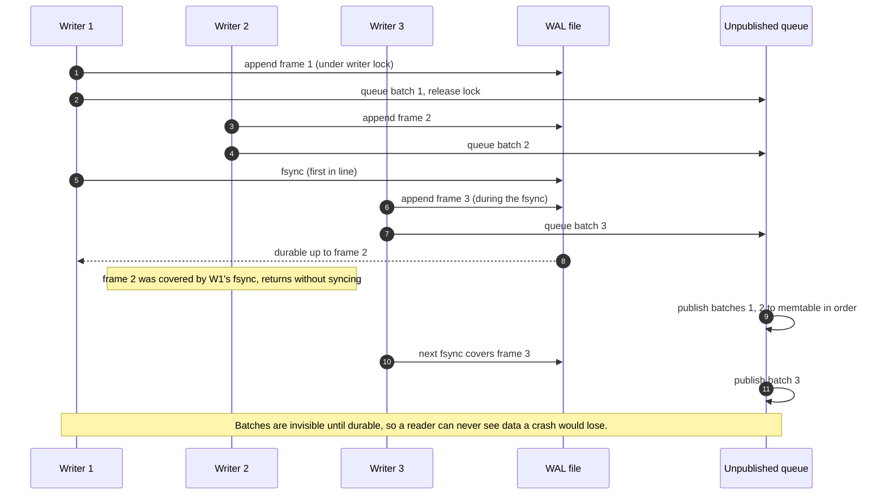
```mermaid
sequenceDiagram
  autonumber
  participant W1 as Writer 1
  participant W2 as Writer 2
  participant W3 as Writer 3
  participant WAL as WAL file
  participant Q as Unpublished queue

  W1->>WAL: append frame 1 (under writer lock)
  W1->>Q: queue batch 1, release lock
  W2->>WAL: append frame 2
  W2->>Q: queue batch 2
  W1->>WAL: fsync (first in line)
  W3->>WAL: append frame 3 (during the fsync)
  W3->>Q: queue batch 3
  WAL-->>W1: durable up to frame 2
  Note over W2: frame 2 was covered by W1's fsync, returns without syncing
  Q->>Q: publish batches 1, 2 to memtable in order
  W3->>WAL: next fsync covers frame 3
  Q->>Q: publish batch 3
  Note over W1,Q: Batches are invisible until durable, so a reader can never see data a crash would lose.
```

### LSM structure and read path

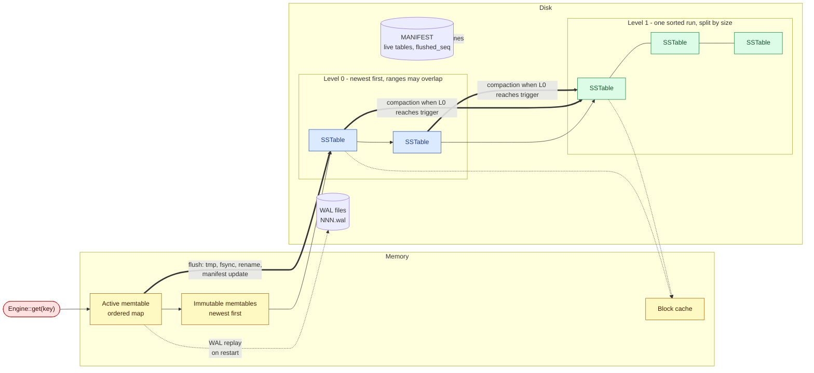
```mermaid
flowchart LR
  classDef mem fill:#fef9c3,stroke:#a16207,color:#422006
  classDef l0 fill:#dbeafe,stroke:#1d4ed8,color:#1e3a8a
  classDef l1 fill:#dcfce7,stroke:#15803d,color:#14532d
  classDef rd fill:#fee2e2,stroke:#b91c1c,color:#450a0a

  GET(["Engine::get(key)"]):::rd
  subgraph RAM["Memory"]
    MT["Active memtable<br/>ordered map"]:::mem
    IM["Immutable memtables<br/>newest first"]:::mem
    BC["Block cache"]:::mem
  end
  subgraph DISK["Disk"]
    WAL[("WAL files<br/>NNN.wal")]
    subgraph L0["Level 0 - newest first, ranges may overlap"]
      T0a["SSTable"]:::l0
      T0b["SSTable"]:::l0
    end
    subgraph L1["Level 1 - one sorted run, split by size"]
      T1a["SSTable"]:::l1
      T1b["SSTable"]:::l1
      T1c["SSTable"]:::l1
    end
    MAN[("MANIFEST<br/>live tables, flushed_seq")]
  end

  GET --> MT --> IM --> T0a --> T0b --> T1a
  MT -.->|"WAL replay<br/>on restart"| WAL
  MT ==>|"flush: tmp, fsync, rename,<br/>manifest update"| T0a
  T0a & T0b ==>|"compaction when L0 reaches trigger"| T1a
  T1a --- T1b --- T1c
  T0a -.-> BC
  T1a -.-> BC
  MAN -.->|"defines"| DISK
```

For each SSTable the read checks, in order: key range, **bloom filter**
(a negative skips the table), sparse index, then the **block cache**. The
first version found wins; a tombstone or expired value reads as absent.
Scans merge all layers with a k-way merge that keeps the highest sequence
number per key, then hide tombstones, expired values and internal keys.

### Compaction rules

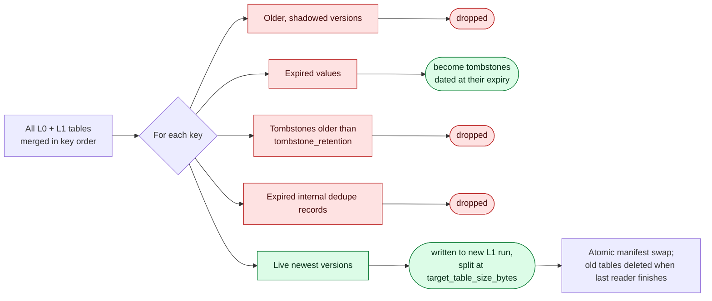
```mermaid
flowchart LR
  classDef k fill:#dcfce7,stroke:#15803d,color:#052e16
  classDef d fill:#fee2e2,stroke:#b91c1c,color:#450a0a

  IN["All L0 + L1 tables<br/>merged in key order"] --> S{"For each key"}
  S --> A["Older, shadowed versions"]:::d --> A1(["dropped"]):::d
  S --> B["Expired values"]:::d --> B1(["become tombstones<br/>dated at their expiry"]):::k
  S --> C["Tombstones older than<br/>tombstone_retention"]:::d --> C1(["dropped"]):::d
  S --> D["Expired internal dedupe records"]:::d --> D1(["dropped"]):::d
  S --> E["Live newest versions"]:::k --> E1(["written to new L1 run,<br/>split at target_table_size_bytes"]):::k
  E1 --> F["Atomic manifest swap;<br/>old tables deleted when last reader finishes"]
```

### Crash recovery

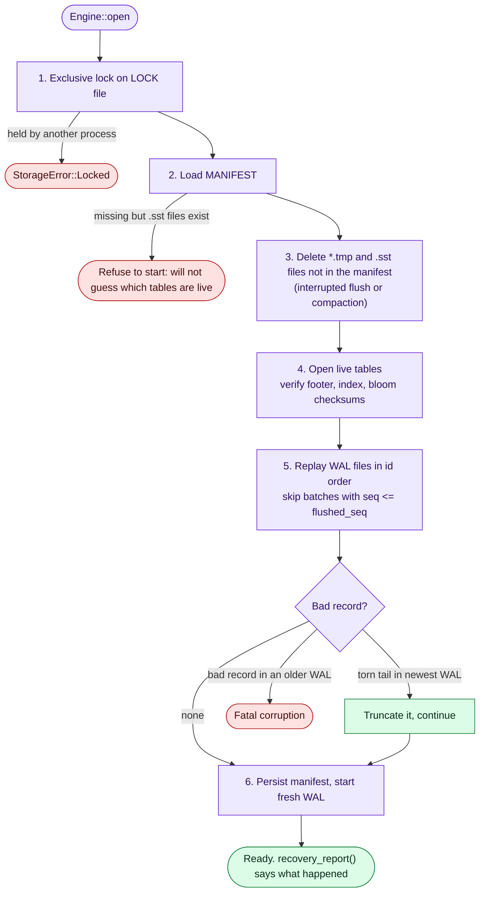
```mermaid
flowchart TD
  classDef ok fill:#dcfce7,stroke:#15803d,color:#052e16
  classDef bad fill:#fee2e2,stroke:#b91c1c,color:#450a0a
  classDef st fill:#ede9fe,stroke:#6d28d9,color:#2e1065

  O(["Engine::open"]):::st --> L["1. Exclusive lock on LOCK file"]:::st
  L -->|"held by another process"| LE(["StorageError::Locked"]):::bad
  L --> M["2. Load MANIFEST"]:::st
  M -->|"missing but .sst files exist"| ME(["Refuse to start: will not guess which tables are live"]):::bad
  M --> CL["3. Delete *.tmp and .sst files not in the manifest<br/>(interrupted flush or compaction)"]:::st
  CL --> T["4. Open live tables<br/>verify footer, index, bloom checksums"]:::st
  T --> W["5. Replay WAL files in id order<br/>skip batches with seq <= flushed_seq"]:::st
  W --> TT{"Bad record?"}:::st
  TT -->|"torn tail in newest WAL"| TR["Truncate it, continue"]:::ok
  TT -->|"bad record in an older WAL"| TF(["Fatal corruption"]):::bad
  TT -->|none| P
  TR --> P["6. Persist manifest, start fresh WAL"]:::st
  P --> R(["Ready. recovery_report() says what happened"]):::ok
```

| Event | Guarantee |
|---|---|
| Process crash, any `SyncMode` | every acknowledged batch is recovered |
| Power loss, `SyncMode::Always` | every acknowledged batch is recovered |
| Power loss, `SyncMode::Never` | a prefix of acknowledged batches is recovered |
| Crash mid-batch | batch recovered entirely or not at all |
| WAL write or fsync error | outcome reported unknown; engine becomes read-only (poisoned) |
| Corrupted table block | read returns `Corruption`; never wrong data |

### On-disk layout and formats

Every file type carries a magic number, a format version and checksums.
Readers reject unknown versions instead of guessing.

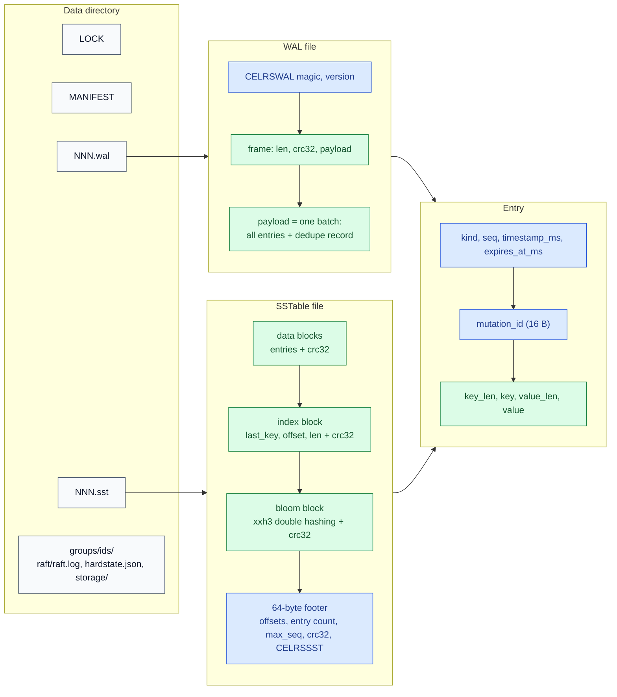
```mermaid
flowchart LR
  classDef f fill:#f8fafc,stroke:#475569,color:#0f172a
  classDef hdr fill:#dbeafe,stroke:#1d4ed8,color:#1e3a8a
  classDef body fill:#dcfce7,stroke:#15803d,color:#14532d
  classDef crc fill:#fee2e2,stroke:#b91c1c,color:#450a0a

  subgraph DIR["Data directory"]
    direction TB
    LOCK["LOCK"]:::f
    MANIFEST["MANIFEST"]:::f
    WALF["NNN.wal"]:::f
    SSTF["NNN.sst"]:::f
    GRP["groups/ids/<br/>raft/raft.log, hardstate.json, storage/"]:::f
  end

  subgraph WALX["WAL file"]
    direction TB
    w1["CELRSWAL magic, version"]:::hdr
    w2["frame: len, crc32, payload"]:::body
    w3["payload = one batch:<br/>all entries + dedupe record"]:::body
    w1 --> w2 --> w3
  end

  subgraph SSTX["SSTable file"]
    direction TB
    s1["data blocks<br/>entries + crc32"]:::body
    s2["index block<br/>last_key, offset, len + crc32"]:::body
    s3["bloom block<br/>xxh3 double hashing + crc32"]:::body
    s4["64-byte footer<br/>offsets, entry count, max_seq, crc32, CELRSSST"]:::hdr
    s1 --> s2 --> s3 --> s4
  end

  subgraph ENT["Entry"]
    direction TB
    e1["kind, seq, timestamp_ms, expires_at_ms"]:::hdr
    e2["mutation_id (16 B)"]:::hdr
    e3["key_len, key, value_len, value"]:::body
    e1 --> e2 --> e3
  end

  WALF --> WALX
  SSTF --> SSTX
  WALX --> ENT
  SSTX --> ENT
```

The `MANIFEST` is replaced atomically (`MANIFEST.tmp`, fsync, rename,
directory fsync). Full byte layouts are in
[docs/STORAGE_ENGINE.md](docs/STORAGE_ENGINE.md#on-disk-formats).

---

## Partitioning and placement

The keyspace is cut into a **fixed 4096 partitions** for the life of the
cluster. Adding nodes moves partitions; it never re-hashes keys.

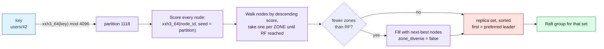
```mermaid
flowchart LR
  classDef k fill:#e0f2fe,stroke:#0369a1,color:#0c4a6e
  classDef p fill:#ede9fe,stroke:#6d28d9,color:#2e1065
  classDef r fill:#fee2e2,stroke:#b91c1c,color:#450a0a
  classDef g fill:#dcfce7,stroke:#15803d,color:#052e16

  K["key<br/>users/42"]:::k -->|"xxh3_64(key) mod 4096"| P["partition 1118"]:::p
  P --> SC["Score every node:<br/>xxh3_64(node_id, seed = partition)"]:::p
  SC --> PICK["Walk nodes by descending score,<br/>take one per ZONE until RF reached"]:::p
  PICK --> FILL{"fewer zones<br/>than RF?"}
  FILL -->|"yes"| FB["Fill with next-best nodes<br/>zone_diverse = false"]:::p
  FILL -->|"no"| RS
  FB --> RS["replica set, sorted<br/>first = preferred leader"]:::r
  RS --> GRP["Raft group for that set"]:::g
```

Why **rendezvous hashing**: the map is a pure function of the node set and
replication factor, so every node computes it without coordination. A
joining node takes only the partitions where it now ranks in the top RF
(about 1/N of them); a leaving node gives up only its own. Measured replica
and leader counts stay within 10 to 15 percent of the mean.

### Epoch fencing: stale routers are refused

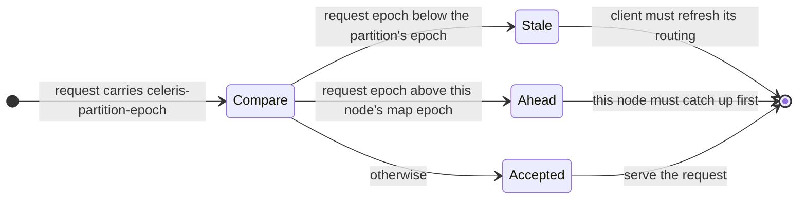
```mermaid
stateDiagram-v2
  direction LR
  [*] --> Compare : request carries celeris-partition-epoch
  Compare --> Stale : request epoch below the partition's epoch
  Compare --> Ahead : request epoch above this node's map epoch
  Compare --> Accepted : otherwise
  Stale --> [*] : client must refresh its routing
  Ahead --> [*] : this node must catch up first
  Accepted --> [*] : serve the request
```

Each partition records the epoch at which *its own* replica list last
changed, so unchanged partitions are never invalidated by a rebalance
elsewhere.

---

## Replication: Raft and membership

### Raft roles (control plane and every data group)

Both use the standard hardening from the Raft thesis: **pre-vote**,
**leader stickiness** and **check-quorum**. A node that was cut off cannot
come back with an inflated term and depose a healthy leader, and a
partitioned leader stops accepting writes that can never commit.

```mermaid
stateDiagram-v2
  direction LR
  [*] --> Follower
  Follower --> PreVote : election timeout, no leader heard
  PreVote --> Follower : majority denies (a leader is alive)
  PreVote --> Candidate : majority grants pre-vote
  Candidate --> Leader : wins majority of votes in term + 1
  Candidate --> Follower : higher term seen, or split vote
  Leader --> Follower : higher term seen
  Leader --> Follower : check-quorum fails (no majority heard)
  note right of PreVote
    Changes no state and raises no term,
    so an isolated node cannot disrupt the cluster.
  end note
  note right of Leader
    Commits a no-op in its term first,
    then serves proposals and read barriers.
  end note
```

### Membership: suspicion is not a verdict

```mermaid
stateDiagram-v2
  direction LR
  [*] --> Alive : joins
  Alive --> Suspect : silent longer than suspect_after_ms
  Suspect --> Alive : refutes with a higher incarnation
  Suspect --> Unreachable : suspicion not refuted within suspicion_timeout_ms
  Unreachable --> Alive : comes back and refutes
  Alive --> Left : graceful leave
  Suspect --> Left : graceful leave
  Left --> [*]
  note right of Suspect
    Still owns its partitions.
    Slow nodes never cause churn.
  end note
```

Precedence is `Alive < Suspect < Unreachable < Left`, and only a member may
raise its own incarnation. The membership view is local and eventually
consistent; it decides who *looks* healthy, never who *owns* data.

### How the control plane reacts to membership changes

```mermaid
sequenceDiagram
  autonumber
  participant G as Gossip view
  participant L as Control-plane leader (every 1 s)
  participant C as Control Raft log
  participant S as Replica groups

  G->>L: placement_nodes() = Alive + Suspect members
  L->>L: differs from committed map's nodes?
  Note over L: Same differing set must persist for<br/>auto_rebalance_after_ms (default 30 s).<br/>A flapping node resets the timer.
  L->>C: propose SetNodes{nodes, replication_factor}
  C->>C: commit, every node derives the SAME PartitionMap, epoch + 1
  C->>S: partitions whose replica SET changed start a Migration
  Note over C: Leader-only changes keep the same group and need no data move.
  Note over L: Refused while migrations are pending (409 migrations_pending)
```

---

## Elasticity: live partition migration

When a placement change gives a partition a new replica set, its data moves
to the Raft group of that set. The control plane drives the move and routing
never points at a group that lacks the data.

```mermaid
stateDiagram-v2
  direction LR
  [*] --> Moving : SetNodes records Migration from to
  Moving --> Fenced : source group commits Fence(P)
  Fenced --> Imported : destination copies data and commits Import chunks
  Imported --> Done : source group commits Release(P)
  Done --> [*] : routing switches to the new group
  note right of Moving
    Requests still go to the source.
  end note
  note right of Fenced
    Source refuses writes with
    503 partition_moving (safe to retry).
    Reads keep working. Data is now final.
  end note
  note right of Imported
    First chunk purges stale copies, then entries load.
  end note
  note right of Done
    Release deletes the source copy and refuses reads
    with 421 partition_moved BEFORE routing switches.
  end note
```

```mermaid
sequenceDiagram
  autonumber
  participant CP as Control plane
  participant SRC as Source group
  participant DST as Destination group

  CP->>SRC: (Moving) leader commits Fence(P)
  SRC-->>CP: AdvanceMigration Moving to Fenced
  Note over SRC: writes to P refused, data frozen
  DST->>SRC: fetch export over request/response (CLXR/CLXS)
  Note over SRC: only a replica that applied the fence answers
  SRC-->>DST: partition P entries
  DST->>DST: commit Import(clear + chunks) in its own Raft log
  DST-->>CP: AdvanceMigration Fenced to Imported
  SRC->>SRC: leader commits Release(P): delete copy, refuse reads
  SRC-->>CP: AdvanceMigration Imported to done
  Note over CP: Release BEFORE the switch means any strict read that<br/>starts after a write to the new group is ordered after Release<br/>and is refused rather than served stale.
```

Honest costs: writes to a moving partition fail retryably until the copy
finishes; versions restart in the destination group, so a client CAS with an
old version fails safely with `condition_failed` and must re-read.

---

## Queries and change streams

`POST /v1/query` takes a key range, a MongoDB-style JSON filter, an optional
projection, an optional sort, optional aggregates and a page size. No query
language parser, no new syntax to learn.

```mermaid
sequenceDiagram
  autonumber
  participant C as Client
  participant Co as Coordinator node
  participant G1 as Group 1 replica
  participant G2 as Group 2 replica

  C->>Co: POST /v1/query {prefix, where, sort, limit, max_scanned}
  par fan out to every serving group
    Co->>G1: filtered scan (strict: after a read barrier on the leader)
    Co->>G2: filtered scan
  end
  G1->>G1: use secondary index if declared, else scan range
  G1->>G1: re-read and re-check the FULL filter on each candidate
  G2->>G2: same, only for partitions this group currently serves
  G1-->>Co: matching rows + resume key
  G2-->>Co: matching rows + resume key
  Co->>Co: cutoff = smallest resume key, keep matches up to it
  Co->>Co: aggregate or sort-merge the merged page
  Co-->>C: page + cursor (no key skipped, none repeated)
```

| Feature | How it works |
|---|---|
| **Filters** | `$eq $ne $gt $gte $lt $lte $in $nin $prefix` and more, typed comparisons (numbers vs numbers, strings vs strings) |
| **Pushdown** | each replica set filters its own data, so only matches cross the network |
| **Bounded work** | a request reads at most `max_scanned` rows; selective filters return short pages with a cursor |
| **Secondary indexes** | reserved keys written in the **same WAL batch** as the data, so index and data commit atomically; built and dropped in resumable steps |
| **Sorting** | order-preserving index encoding; descending uses bitwise complement, so the engine only ever iterates forwards |
| **Aggregates** | `count`, `sum`, `min`, `max` merge exactly across pages and groups; average is sum / count on the client |

### Live change streams

```mermaid
flowchart LR
  classDef w fill:#fee2e2,stroke:#b91c1c,color:#450a0a
  classDef b fill:#ede9fe,stroke:#6d28d9,color:#2e1065
  classDef c fill:#e0f2fe,stroke:#0369a1,color:#0c4a6e

  WR["Committed write<br/>(Raft apply or direct)"]:::w --> PB["publish_batch()"]:::b --> BUS["Event bus"]:::b
  BUS --> F1{"prefix filter"}:::b
  F1 --> WS1["WebSocket /v1/watch?prefix=users/"]:::c --> UI["React useCeleris()<br/>live UI"]:::c
  F1 --> WS2["WebSocket watcher"]:::c --> SVC["Backend service"]:::c
```

---

## Security model

```mermaid
flowchart LR
  classDef pub fill:#e0f2fe,stroke:#0369a1,color:#0c4a6e
  classDef sec fill:#ede9fe,stroke:#6d28d9,color:#2e1065
  classDef int fill:#fee2e2,stroke:#b91c1c,color:#450a0a

  subgraph EXT["Client edge (8080)"]
    TLS1["HTTPS (rustls)<br/>optional, h2 or HTTP/1.1"]:::pub
    TOK["Bearer token<br/>stored only as SHA-256 hash"]:::sec
    SC["Scope check from route + method<br/>read | write | admin"]:::sec
    TLS1 --> TOK --> SC
  end
  subgraph OPEN["Always open, no data"]
    H["/health  /ready  /metrics"]:::pub
  end
  subgraph INT["Cluster edge (7000)"]
    MT["Mutual TLS<br/>every peer needs a cert from the cluster CA"]:::int
    VR["Dialer verifies the server cert<br/>against the dialed host"]:::int
    MT --- VR
  end
  SC --> ENG["Handler"]
  ENG --> MT
```

* Tokens are hashed at rest and scoped independently (`read`, `write`, `admin`).
* Without tokens, admin endpoints stay **loopback-only**; with tokens, the `admin` scope replaces that rule.
* WebSockets accept `?access_token=` (the only route that does, because tokens in URLs end up in logs).
* The cluster port can require **mutual TLS**: a plain node and a TLS node cannot talk, so the cluster switches over as a whole.

---

## Deployment topologies

```mermaid
flowchart TB
  classDef dev fill:#e0f2fe,stroke:#0369a1,color:#0c4a6e
  classDef dock fill:#ede9fe,stroke:#6d28d9,color:#2e1065
  classDef k8s fill:#dcfce7,stroke:#15803d,color:#052e16
  classDef ops fill:#f1f5f9,stroke:#475569,color:#0f172a

  subgraph S1["1. Local or embedded"]
    A1["celeris start<br/>single node, RF 1"]:::dev
    A2["or embed celeris-storage<br/>as a Rust library"]:::dev
  end

  subgraph S2["2. Docker Compose"]
    B1["node-a :8081"]:::dock
    B2["node-b :8082"]:::dock
    B3["node-c :8083"]:::dock
    B1 <--> B2 <--> B3 <--> B1
  end

  subgraph S3["3. Kubernetes StatefulSet"]
    direction TB
    K0["celeris-0"]:::k8s
    K1["celeris-1"]:::k8s
    K2["celeris-2"]:::k8s
    HS["Headless Service celeris-peers<br/>stable DNS for the cluster port"]:::ops
    CS["Client Service :8080"]:::ops
    PDB["PodDisruptionBudget<br/>keeps a Raft majority up"]:::ops
    PV[("PersistentVolume per pod")]:::ops
    HS --- K0 & K1 & K2
    CS --> K0 & K1 & K2
    PDB -.-> K0 & K1 & K2
    K0 & K1 & K2 --- PV
  end

  subgraph S4["4. AWS reference"]
    C1["3 x EC2 or EKS nodes<br/>one per availability zone"]:::ops
    C2["EBS gp3 volumes"]:::ops
    C3["NLB for :8080<br/>Prometheus for /metrics"]:::ops
    C1 --- C2
    C3 --> C1
  end
```

Pod names are the node IDs and the voters; each pod advertises
`<pod>.celeris-peers.<namespace>.svc.cluster.local:7000`. Full guide:
[docs/DEPLOYMENT.md](docs/DEPLOYMENT.md). Backups are physical snapshots on a
single node and JSON-lines exports (idempotent import) for clusters.

---

## How it is verified

```mermaid
flowchart BT
  classDef l1 fill:#dcfce7,stroke:#15803d,color:#052e16
  classDef l2 fill:#dbeafe,stroke:#1d4ed8,color:#1e3a8a
  classDef l3 fill:#ede9fe,stroke:#6d28d9,color:#2e1065
  classDef l4 fill:#fee2e2,stroke:#b91c1c,color:#450a0a

  U["Unit tests<br/>every on-disk format: round trips, every WAL truncation point,<br/>checksum + version rejection; Raft and gossip in a simulator"]:::l1
  I["Integration tests<br/>restart recovery, flush + compaction, TTL, CAS atomicity,<br/>mutation-ID dedupe across restarts, corrupted files, locking"]:::l2
  P["Model-based property test<br/>random ops with flushes, compactions and restarts<br/>compared against an in-memory model"]:::l3
  C["Crash test<br/>kill a writer process mid-stream 6 times:<br/>every acked write survives, recovered data is a gap-free prefix"]:::l4
  E2E["API + CLI end-to-end<br/>every endpoint and error code, real sockets, real celeris process"]:::l2
  LIN["Linearizability checker<br/>concurrent histories under leader failure on the strict path"]:::l4
  CH["Chaos suite<br/>seeded, replayable partitions and restarts under CAS load:<br/>acked <= value <= acked + unknown"]:::l4

  U --> I --> P --> C
  I --> E2E --> LIN --> CH
```

The chaos workload increments counters with read-then-compare-and-set against
random nodes while faults are injected (isolate a node, crash and restart on
the same data). The invariant `acked <= final <= acked + unknown` fails if any
write is lost or applied twice, and afterwards every replica must converge.
Replay a run with `CELERIS_CHAOS_SEED`.

## Performance

Criterion micro-benchmarks for the storage engine (`cargo bench -p
celeris-storage`). 128-byte values, 50,000 preloaded keys, `SyncMode::Never`
unless noted. One run on a Windows 11 laptop with an NVMe SSD, so use these
to compare changes, not as absolute numbers.

| Benchmark | Time | Throughput |
|---|---|---|
| `put/single` | 6.4 µs | 156 K puts/s |
| `put/batch_10` | 30 µs | 330 K keys/s |
| `put/fsync/1_writers` (`Always`) | 403 µs | 2.5 K puts/s |
| `put/fsync/8_writers` (`Always`, group commit) | 183 µs per put | 5.5 K puts/s |
| `get/hit/memtable` | 1.1 µs | 920 K/s |
| `get/hit/sstable` | 1.9 µs | 540 K/s |
| `get/miss/sstable` (bloom filter) | 0.26 µs | 3.8 M/s |
| `scan/100/sstable` | 23 µs | 4.3 M rows/s |
| `maintenance/flush_50k` | 62 ms | 800 K keys/s |
| `maintenance/compact_50k` | 57 ms | 880 K keys/s |

Group commit with `fsync` on every batch lifted throughput 3.2x with 8
clients and 4.7x with 32 clients (A/B on the same machine). These are
single-node engine numbers; replicated write latency adds a Raft round-trip.

---

## Repository layout

```text
crates/
  celeris-core/      consistency modes, mutation IDs, key limits, partition map (no I/O)
  celeris-storage/   single-node LSM storage engine
  celeris-cluster/   SWIM-style membership + Raft (sans-IO, simulation-tested)
  celeris-server/    node runtime: HTTP/JSON API, replica groups, migration, TLS, auth, metrics
  celeris-cli/       the `celeris` binary: init/start/stop/status/put/get/scan/query/doctor/bench
  celeris-testkit/   failure-injection harnesses, linearizability checker
sdks/
  typescript/        @celeris/client (+ React hook)
  python/            celeris-client
  rust/              celeris-client crate (workspace member)
  go/                Go module
console/           browser admin console (React + Vite)
website/           landing page (React, GSAP, Lenis)
install.sh, install.ps1   release installers
Dockerfile, docker-compose.yml   container image and a local 3-node cluster
deploy/kubernetes/ StatefulSet manifest
docs/
  API.md             HTTP API contract, error model, metrics
  CLI.md             commands, exit codes, retry semantics, env vars
  CONSISTENCY.md     what each mode guarantees; implementation status
  STORAGE_ENGINE.md  write/read paths, recovery guarantees, on-disk formats
  PARTITIONING.md    key to partition to replica mapping, epochs, rebalancing
  DECISIONS.md       every design decision, with the reasoning
  DEPLOYMENT.md      Docker, compose, Kubernetes, AWS reference
  ROADMAP.md         milestones and what is left
```

## Build and test

Requires Rust 1.89+ (`rustup` recommended).

```bash
cargo build --workspace
cargo test --workspace
cargo clippy --workspace --all-targets -- -D warnings
cargo fmt --all -- --check
```

**Windows:** the MSVC toolchain works out of the box with Visual Studio
Build Tools. With the GNU toolchain (`x86_64-pc-windows-gnu`) you need a
64-bit mingw-w64 (e.g. `winget install BrechtSanders.WinLibs.POSIX.UCRT`).
Put its `bin` directory **before** any old 32-bit MinGW on `PATH`.

## Using the storage engine (embedded)

```rust
use std::time::Duration;
use celeris_core::MutationId;
use celeris_storage::{Condition, Engine, Op, Options, WriteBatch};

let db = Engine::open("./celeris-data", Options::default())?;

db.put("users/42", r#"{"name":"Ada"}"#)?;
let user = db.get(b"users/42")?;                      // Option<Record>

// Atomic batch with TTL, idempotent under retry.
let id = MutationId::random();
let batch = WriteBatch::new(id)
    .put("users/43", "{}")
    .put_with_ttl("sessions/abc", "token", Duration::from_secs(3600));
db.write(batch.clone())?;
assert!(db.write(batch)?.deduplicated);                 // retry is safe
assert!(db.mutation_status(id)?.is_some());             // "did it commit?"

// Compare-and-set.
let v = db.get(b"users/42")?.unwrap().version;
db.write(WriteBatch::new(MutationId::random()).push(Op::Put {
    key: "users/42".into(),
    value: r#"{"name":"Ada L."}"#.into(),
    ttl: None,
    condition: Some(Condition::Version(v)),
}))?;

let page = db.scan_prefix(b"users/", 100)?;
```

## Known limits

Celeris is pre-1.0 and says so plainly:

* **Cluster shape:** control-plane voters are fixed at bootstrap (3 or 5), and
  data nodes must be voters. Changing voters needs joint consensus, which is
  deferred.
* **Transactions:** batches are atomic within one replica set. A batch that
  spans replica sets is rejected (`cross_group_batch`) rather than faked.
* **Scans are not point-in-time snapshots** (D-010): concurrent writes may or
  may not be observed.
* **Compaction** is full L0 plus L1 merge (two levels), so write amplification
  grows with data size.
* **Snapshots and exports** are built in memory, up to 1 GiB per group or
  batch of partitions.
* **Migration:** writes to a moving partition fail retryably; mutation-ID
  records do not move with the data.
* **Available mode:** a pending write is invisible until reconciled and is
  lost if its accepting node is lost before reconciliation.
* **Fault testing:** no fsync-dropping filesystem harness yet, so power-loss
  guarantees follow from fsync ordering rather than automated tests. Clock
  skew, disk faults and long soak runs are not yet in the chaos suite.
* **Backups:** no incremental backups or point-in-time recovery yet.

The full list, with reasoning, is in [docs/DECISIONS.md](docs/DECISIONS.md).

## Author

Built by **Vinit Patil**. Questions and ideas are welcome:
[vinitonterminal@gmail.com](mailto:vinitonterminal@gmail.com) ·
[LinkedIn](https://www.linkedin.com/in/vinit-patil-a3384728a/)

## License

Apache-2.0
